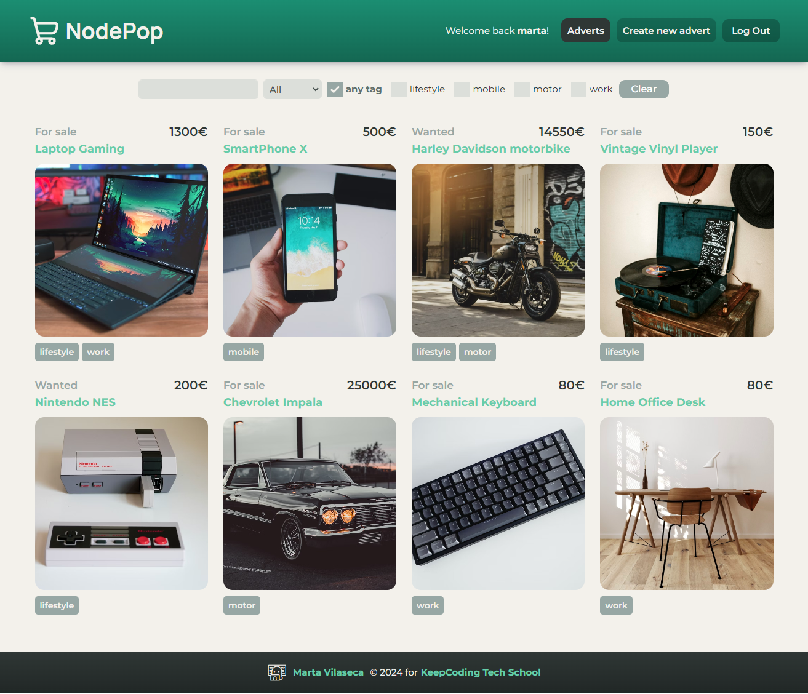

# 🛒 Nodepop React

> 👤 Marta Vilaseca Foradada  
> 💻 XVI Bootcamp Full Stack Web  
> 📅 5 Mayo 2024

Vamos a crear una aplicación de tipo dashboard, que será la interfaz gráfica desde la que podremos gestionar el API de anuncios **Nodepop**.



## Instalar y arrancar proyecto

Creamos un directorio llamado por ejemplo **/nodepop**.

Desde dentro de dicho directorio y desde nuestro terminal clonamos [este proyecto](https://github.com/davidjj76/nodepop-api) para el backend, instalamos sus dependencias y lo arrancamos:

```sh
git clone git@github.com:davidjj76/nodepop-api.git
cd nodepop-api
npm install
npm start
```

Volvemos a nuestro directorio raíz **/nodepop** y hacemos lo mismo con este repositorio para el frontend:

```sh
git clone git@github.com:marta-vilaseca/keepcoding-intro-react-pra.git
cd keepcoding-intro-react-pra
npm install
npm run dev
```

Podremos ahora visitar y trabajar con la aplicación mediante el navegador en http://localhost:5173/

## Tecnologías utilizadas

    

## Frontend

La aplicación frontend es una SPA (Single Page Application) desarrollada con React como librería principal.

### Rutas de la aplicación

- **Públicas: Accesibles para cualquier usuario.**
  - [x] `/login`: **LoginPage**
- **Protegidas: Accesibles SOLO para usuarios autenticados.** Cualquier acceso de un usuario no autenticado a cualquiera de estas rutas redireccionará a `/login`.
  - [x] `/`: Redirecciona a `/adverts`
  - [x] `/adverts`: **AdvertsPage**
  - [x] `/adverts/:id`: **AdvertPage**
  - [x] `/adverts/new`: **NewAdvertPage**
  - [x] Para cualquier otra url que no coincida se creará un componente **NotFoundPage** que informará al usuario que la página solicitada no existe (la típica 404).

### Funcionalidad de cada página-componente

- **Login Page**
  - [x] Formulario con inputs para recoger **email** y **password** del usuario
    - [x] El botón de login no se activará hasta que no haya algo escrito en ambos campos
  - [x] **Checkbox "recordar contraseña"**. Significa que si la marcamos, cerramos la pestaña del navegador y luego volvemos a la aplicación, no será necesario que introduzcamos usuario y password otra vez.
- **Adverts Page**
  - [x] Listado de anuncios. De cada anuncio se muestra su **nombre**, **precio**, su **tipo** (si es compra o venta), los **tags** y la **foto** (si no tiene, se muestra una por defecto)
    - [x] Cuando no hay ningún anuncio, muestra un mensaje al respecto que incluye un botón para crear uno
    - [x] Cada anuncio tiene un **enlace a su página individual** (son clicables el título y la foto)
  - [x] **Zona de filtros**. Se muestra si hay anuncios y permite ir filtrando de acuerdo a **nombre**, **tipo** (compra/venta) o **tags**.
    - [x] Los filtros **son acumulativos** (es decir a medida que vas seleccionando se vuelve más específico el filtrado)
    - [x] El formulario cuenta con un **botón clear** que resetea los filtros y vuelve a mostrar el listado completo
    - [x] Si no se encuentran anuncios que cuadren con los filtros especificados, se muestra un mensaje al respecto
- **Advert Page**
  - [x] Detalle del anuncio con toda su info
  - [x] Incluye **botón de borrado** (con confirmación)
    - [x] Si borras el anuncio, te redirige de vuelta al listado general
  - [x] Si el anuncio no existe, nos redirige a la página de **error 404 not found**
- **New Advert Page**
  - [x] Formulario de creación de anuncio
  - [x] Permite introducir **nombre**, **tipo** (compra/venta), **tags**, **precio** y **foto** (opcional)
    - [x] El botón de enviar no se activa hasta que no has completado todos los campos obligatorios
    - [x] El campo de precio solo admite valores numéricos
    - [x] El campo de foto está restringido para admitir solamente jpg y png. Aún así, hace una segunda comprobación al enviar la info del anuncio y devuelve error si se intenta adjuntar un archivo de cualquier otro tipo
  - [x] Una vez creado el anuncio nos redirige a la página del mismo
- **Otros detalles implementados**
  - [x] Manejo de errores: el usuario recibe info cuando se producen errores (o como se ha comentado previamente, cuando no hay contenido que mostrar)
  - [x] Loader mientras se realizan y resuelven peticiones a la API
  - [x] Menú de navegación (visible solamente para usuarios logados):
    - [x] Mensaje de bienvenida para el usuario
    - [x] Enlaces a **adverts** y **create advert**
    - [x] Botón de logout (con confirmación)
  - [x] El logo es visible en todo momento y clicarlo te redirige a la página principal
  - [x] Página not found: muestra mensaje de error. Al tener la cabecera y pie comunes a toda la web, puede navegarse desde ella a otras secciones fácilmente.

## Backend

Como se ha comentado anteriormente, utilizamos [este proyecto](https://github.com/davidjj76/nodepop-api) como backend.

Una vez instalado, tendremos nuestro backend corriendo en el puerto 3001 (por defecto, es configurable). Tendremos disponible un swagger en http://localhost:3001/swagger/ donde poder probar los distintos endpoints:

### Endpoints API

```
/api/auth/signup
```

- **POST:** Nos permite crear usuarios.

```
/api/auth/me
```

- **GET:** Nos devuelve la información del usuario autenticado

```
/api/auth/login
```

- **POST:** Devuelve un token de acceso cuando le pasamos un email y
  password de un usuario correctos.

```
/api/v1/adverts
```

- **GET:** Devuelve un listado de anuncios, con la posiblidad de aplicar filtros con la query que enviemos en la URL. Los filtros posibles son:
  - `name=coche` (que el nombre empiece por “coche”, sin importar
    MAY/MIN)
  - `sale=true/false` (si el anuncio es de compra o venta)
  - `price=0-25000` (precio dentro del rango indicado)
  - `tags=motor,work` (que tenga todos los tags)
- **POST:** Crea un anuncio.

```
/api/v1/adverts/tags
```

- **GET:** Devuelve el listado de tags disponibles.

```
/api/v1/adverts/:id
```

- **GET:** Devuelve un único anuncio por Id.
- **DELETE:** Borra un anuncio por Id.

### Importante

- Todos los endpoints bajo **/adverts** requieren que se envíe el token proporcionado en el endpoint de login. Se ha de enviar en la cabecera de la petición de la siguiente forma:

```
Header[‘Authorization’] = `Bearer ${token}`
```

- Los datos del backend son persistidos en una **base de datos sqlite** en el directorio **/data**
- Las fotos subidas al backend son almacenadas en el directorio **/uploads** y servidas por el backend cómo contenido estático en **/public** **(la ruta pública de cada foto es almacenada en la base de datos)**.
